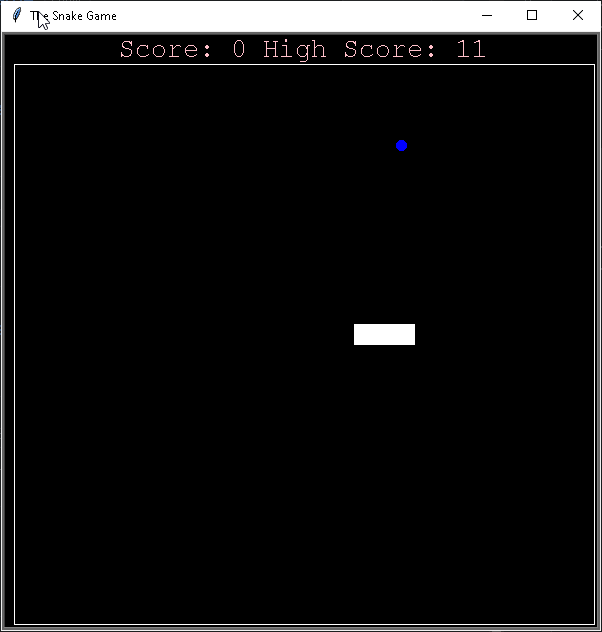

# 🐍 The Classic Snake Game 🐍

A fun and addictive Snake game built using Python's turtle module. Guide the snake, eat the food, grow longer, and avoid crashing into the walls or your own tail. How long can you survive?

## 📜 Description

This game is a classic implementation of the Snake game, where the objective is to control the snake, eat food to grow, and avoid hitting the walls or your own body. Each time the snake eats food, it grows longer, and the score increases. The game ends when the snake collides with a wall or itself.

### Key Features:
- **Smooth Gameplay**: Fast-paced action with continuous snake movement.
- **Food Generation**: Random food spawning on the screen.
- **Boundaries**: Clear and visible boundaries to avoid.
- **Score Tracking**: Track your progress and challenge yourself for a high score.

---
## 🚀 How to Play
1. Use the Arrow keys:
- ⬆️ **Up**: Move the snake upwards
- ⬇️ **Down**: Move the snake downwards
- ⬅️ **Left**: Move the snake to the left
- ➡️ **Right**: Move the snake to the right 
2. Eat the food:
- 🟠 The food appears randomly on the screen. Every time you eat it, the snake grows longer and your score increases.
3. Avoid crashing:
- Don't hit the walls (boundary of the game area).
- Avoid colliding with your own tail.
4. Survive and Score:
- The longer you survive and the more food you eat, the higher your score becomes.

## ▶️ Running the Game

### Prerequisites

Before you begin, make sure you have Python installed on your machine (Python 3.6 or higher).

### Clone the Repository

Clone this repository to your local machine:

```sh
# Clone the repository
git clone https://github.com/Tsaousidis/The-Classic-Snake-Game.git

# Navigate to the project folder
cd The-Classic-Snake-Game
```

### Run the Game

To start the game, run the following command:

```sh
# Run the game
python main.py
```
Enjoy playing the game! 🎮

---

## 🎥 Demo


---

## 🛠️ Features & Updates
- **Boundary Visualization**: Added visible boundary lines so you can clearly see the game area.
- **Bug Fixes**: Fixed issues where rapid key presses could cause unexpected behavior in the snake's movement.
- **Enhanced Controls**: Improved handling of snake direction changes to avoid sudden wrong moves.

---

👨‍💻 Created by [Tsaousidis](https://github.com/Tsaousidis)
🎉 Enjoy the game! Let me know if you have any feedback or suggestions! 🎉


